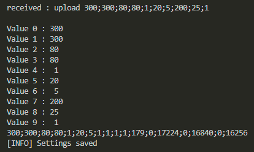

# BPC/DE2_Project_Climate_Chamber_System

## Abstract
 - The goal of the project would is to create a system that measures key environmental parameters (such as temperature, humidity, light levels, soil moisture) for tropical plants.
 - This system should also allow the user to control or adjust environmental conditions and visualize the data.

 - download [video](Projekt_DE2_v2_compressed.mp4) for quick introduction or see it [online](https://vutbr-my.sharepoint.com/:v:/g/personal/246975_vutbr_cz/EZBG8xMaKs9Mt1U4UbR38VkB0fj96phy9CW1poMam4rAzw?e=LGnf4O&nav=eyJyZWZlcnJhbEluZm8iOnsicmVmZXJyYWxBcHAiOiJTdHJlYW1XZWJBcHAiLCJyZWZlcnJhbFZpZXciOiJTaGFyZURpYWxvZy1MaW5rIiwicmVmZXJyYWxBcHBQbGF0Zm9ybSI6IldlYiIsInJlZmVycmFsTW9kZSI6InZpZXcifX0%3D)

<figure style="text-align: center;">
    
</figure>

## Team members

- **Vít Vašenka** : Responsible for RTC, LED and pump control

- **Jindřich Zobač** : responsible for UI, main.c, UART communication

- **Erik Straka** : responsible for sensors readings

- **Artem Kostenko** : responsible for fan control, Readme.md

## Theoretical description and explanation

Tropical plants require specific environmental conditions to thrive, including:

 1. Temperature: Maintaining a specific temperature range.
 2. Humidity: Ensuring consistent moisture levels in the air.
 3. Light: Providing the right light intensity and duration.
 4. Soil Moisture: Monitoring and watering plants appropriately.

The core of the Climate Chamber Control System (CCCS) is an Arduino Nano, which processes sensor data and controls connected peripherals. In its current version, the system monitors air temperature and humidity. Temperature stabilization is achieved using a fan controlled by a PID algorithm.

Lighting is provided by seven high-performance LED diodes with a wide light spectrum. These LEDs are automatically controlled according to a preset schedule managed by an RTC module.

System communication is handled via a serial port. CCCS supports the UART protocol, enabling data retrieval and parameter configuration.

Future upgrades will include features like automatic irrigation based on soil moisture, CO2 concentration monitoring, and an application for long-term data tracking.

## Hardware description of demo application
Every great project starts on the planning board. The folowing diagram shows peripherals connected to the Arduino nano, both already implemented as we created it prior to actual hardware implementation.
<figure style="text-align: center;">
    
    <figcaption>Block diagram</figcaption>
</figure>
Choice of pins was carefully thought out to make best use of Arduino capabilities, using digital pins for boolean types of sensors and devices, pwm pins for fan control, I2C pins for the I2C bus and analog pins for analog sensors.

### 1. Mainboard
The simple mainboard integrates Aruino Nano board, RTC module and relays as well as screw terminals for connection of the rest of the system
<figure style="text-align: center;">
    
</figure>

### 2. Sensors and modules
- **DHT 22 Sensor**: Measures temperature and humidity of the air to monitor the environment. Uses simple 1-wire protocol to send data. Easy to use but the data transfer is not very reliable. The system keeps trace of unsuccessful attempts to retrieve data from sensor and in case of repeated fails informs the user via UART
  
  `[INFO] unable to read DHT data xx times in a row`

- **BMP280 Sensor**: Provides additional environmental data, including pressure and temperature of LED heatsink. LED temperature is stabilized to prevent overheating and potential decrease of lifespan.
  
- **RTC**: Keeps track of day and night to support time-based operations, mainly switching the lighting on and off according to a schedule set by user. In future also to be used for automatic irrigation.

- **Analog soil humidity sensor**: In the future, this will be used to keep track of soil moisture to enable automatic irrigarion. It is a resisitive sensor that will be connected in resistor divider topology to Arduino internal ADC

- **water level sensor**: this is another to-be-implemented sensor to check if there's enough water to trigger the irrigation process

### 3. Peripherals for Climate Control
- **Fans**: Regulate temperature and humidity.
- **Lights**: Provide artificial lighting for photosynthesis. Consists of 4 warm white and 3 cold white COB LEDs for optimal light spectrum
<figure style="text-align: center;">
    
</figure>

- **Water Pump**: Irrigates the soil automatically when moisture levels are low. (not implemented yet)

### 4. Power supply
We used mini-ATX PC supply for our project. These supplies are easily obtained from old PCs and serve great for our purpose. They have standby output of 5V and also 12V output that can be switched on or off independently and provides enough power to run the lights and fans. We use that feature during startup of the system to connect the fans after the system has initialized.
5V network is used for low-power components whereas 12V network is used for fans, leds and water pump.

### 5. Display
16x2 LCD backlit display is used to show statistic and enable basic settings change. This display was chosen for it good readability and simplicity of use. The display is equipped with I2C shield to save precisious GPIOs.

## Software description
- We developed modular code with clear responsibilities:
  - **fan_PID.c**: Handles fan speed control using PID logic.
  - **rtc_control.c**: Manages time-based operations and schedules.
  - **outputControl.c**: Controls GPIO outputs, including lights and pumps.
  - **variables.c**: Stores shared variables between different modules.
 
- For efficient task management, we used flags and timers to organize and prioritize operations.

### 1. Control Logic
- **PID Control**: We implemented precise fan operation using PID control logic.
- **Lighting Schedule**: We used a real-time clock (RTC) to adjust lighting schedules dynamically based on sunrise and sunset times.
- **Automated Watering**: We automated soil irrigation based on moisture levels detected by sensors. The hardware side still waits for implementation but from software point of view, everything is ready.

**Variables flowchart**: All modules have access to variables file that stores global variables like peripherals status and configuration settings. Settings are automatically sadef to EEPROM and loaded after startup to prevent loss in case of system reset.

<figure style="text-align: center;">
    
    <figcaption>Variables diagram</figcaption>
</figure>

flowchart for [fan_PID.c](lib/fan_PID.c)

See [fan_PID README](lib/fan_senzor/fan_PID.md) for more information about this module
<figure style="text-align: center;">
    
    <figcaption>Fan PID diagram</figcaption>
</figure>

flowchart for [rtc_control.c](lib/rtc_control.c) 

See [rtc_control README](lib/RTC/rtc_control.md) for more information about this module
<figure style="text-align: center;">
    
    <figcaption>RTC control diagram</figcaption>
</figure>

flowchart for [main.c](src/main.c)

See [main README](src/main.md) for more information about main file
<figure style="text-align: center;">
    
    <figcaption>main.c diagram</figcaption>
</figure>

### 2. User Interface and communication with PC

#### LCD Display
The "UI" consists of 5 screens of which 4 are informational and 5th is for changing settings. The system automatically loops trough the screens for convenient access to important information. Navigation is possible trough keys in serial port
  - b : switching screens
  - d : down
  - u : up
  - r : right
  - l : left
in future, display will have dedicated keyboard to alow control without PC connected.

##### Screens
  1. : displays temp. of air, humidity of air and humidity of soil, time
<figure style="text-align: center;">
    
    <figcaption>Screen 1</figcaption>
</figure>

  2. : information regarding LED light
<figure style="text-align: center;">
    
    <figcaption>Screen 2</figcaption>
</figure>

  3. : information about state of fans
<figure style="text-align: center;">
    
    <figcaption>Screen 3</figcaption>
</figure>

  4. : information about water level, pump and time of autowatering
<figure style="text-align: center;">
    
    <figcaption>Screen 3</figcaption>
</figure>

  5. : Screen to adjust system variables like max. temp, max. humidity etc.
<figure style="text-align: center;">
    
    <figcaption>Screen 4</figcaption>
</figure>

#### UART Communication
Allows users to adjust settings via a terminal interface.
<figure>
    
    <figcaption>Initialization sequence</figcaption>
</figure> 

  1. **stats command** : yelds string in csv-like format of current values of modules variables in format
   
  `TEMP1;TEMP2;HUM1;HUM2;LED;fan_big;fan_led;wlevel;hours;minutes;secs `
<figure>
    
    <figcaption>calling stats command</figcaption>
</figure> 

  1. **upload command** : settings variables can be uploaded via upload command in format

  `upload(MaxT1*10 MaxT2*10 MaxH1 MinH2 SR SS water_time KP1*10 KI1*10 KD1*10) `

<figure>
    
    <figcaption>calling upload command</figcaption>
</figure> 

## Image gallery
<figure style="text-align: center;">
    
</figure>

<figure style="text-align: center;">
    
</figure>

## References
1. [ADC from GitHub of Tomas Fryza](https://github.com/tomas-fryza/avr-course/tree/master/archive/labx-adc)
2. [UART from GitHub of Tomas Fryza](https://github.com/tomas-fryza/avr-course/tree/master/lab5-uart)
3. [twi from GitHub of Tomas Fryza](https://github.com/tomas-fryza/avr-course/tree/master/solutions/lab6-i2c-scan/lib/twi)
4. [GPIO from GitHub of Tomas Fryza](https://github.com/tomas-fryza/avr-course/tree/master/lab2-gpio)
5. [Datasheet of ATmega328p](https://www.microchip.com/en-us/product/ATmega328p)
6. [Draw.io](https://app.diagrams.net)
7. [Mermaid Editor](https://mermaid-js.github.io)
8. [ChatGPT](https://chatgpt.com) (consultation purposes)
9. [LCD screenshot generator](http://avtanski.net/projects/lcd/)
10. [Shotcut video editor](https://www.shotcut.org/)
11. [ADC and LCD library by Marian Hrinko](https://github.com/Matiasus/HD44780_PCF8574)

## Licesing terms
This project is licensed under the Apache License 2.0.
You are free to use, modify, and distribute this software under the terms of the license.
Key permissions include:
Commercial use, Modification, Distribution, Patent use, Private use

However, the license requires proper attribution, including:

- Including a copy of the license in your project.
- Providing notices for any modifications you make to the original code.

For the full license text, please see the [LICENSE](LICENSE) file.
For more details on Apache License 2.0, see the official documentation.
