# BPC/DE2_Project_Climate_Chamber_System

## Description
 - The goal of the project would be to create a system that measures key environmental parameters (such as temperature, humidity, light levels, soil moisture) for tropical plants.
 - This system should also allow the user to control or adjust environmental conditions and visualize the data.

## Team members

- **Vít Vašenka**

- **Jindřich Zobač**

- **Erik Straka**

- **Artem Kostenko**

## Theoretical description and explanation

Tropical plants require specific environmental conditions to thrive, including:

 1. Temperature: Maintaining a specific temperature range.
 2. Humidity: Ensuring consistent moisture levels in the air.
 3. Light: Providing the right light intensity and duration.
 4. Soil Moisture: Monitoring and watering plants appropriately.

The goal is to build an automated system that:

 1. Monitors these parameters using sensors.
 2. Controls devices like fans, lights, and water pumps to maintain ideal conditions.
 3. Allows users to set preferences and view current conditions.

## Hardware description of demo application

## 1. Sensors for Monitoring
- **DHT Sensor**: Measures temperature and humidity to monitor the environment.
- **BMP280 Sensor**: Provides additional environmental data, including pressure and temperature.
- **RTC**: Measures real-time clock to support time-based operations.

## 2. Actuators for Control
- **Fans**: Regulate temperature and humidity.
- **Lights**: Provide artificial lighting for photosynthesis.
- **Water Pump**: Irrigates the soil automatically when moisture levels are low.

## 3. User Interface
- **LCD Display**: Displays the current environmental conditions to the user.
- **UART Communication**: Allows users to adjust settings via a terminal interface.

## 4. Control Logic
- **PID Control**: We implemented precise fan operation using PID control logic.
- **Lighting Schedule**: We used a real-time clock (RTC) to adjust lighting schedules dynamically based on sunrise and sunset times.
- **Automated Watering**: We automated soil irrigation based on moisture levels detected by sensors.

## 5. Microcontroller
- We used an **Arduino Nano (ATmega328P)** to interface with all sensors and control actuators.

## Software description
- We developed modular code with clear responsibilities:
  - **fan_PID.c**: Handles fan speed control using PID logic.
  - **rtc_control.c**: Manages time-based operations and schedules.
  - **outputControl.c**: Controls GPIO outputs, including lights and pumps.
  - **variables.c**: Stores shared variables between different modules.

- For efficient task management, we used flags and timers to organize and prioritize operations.

Variables flowchart

flowchart for [fan_PID.c](lib/fan_PID.c)[fan_PID README](lib/fan_senzor/fan_PID.md)

flowchart for [rtc_control.c](lib/rtc_control.c)[rtc_control README](lib/RTC/rtc_control.md)

flowchart for [main.c](src/main.c)[main README](src/main.md)

## Component(s) simulation

Write descriptive text and put simulation screenshots of your components.

## Instructions

Write an instruction manual for your application, including photos and a link to a short app video.

## References
1. [ADC from GitHub of Tomas Fryza](https://github.com/tomas-fryza/avr-course/tree/master/archive/labx-adc)
2. [UART from GitHub of Tomas Fryza](https://github.com/tomas-fryza/avr-course/tree/master/lab5-uart)
3. [twi from GitHub of Tomas Fryza](https://github.com/tomas-fryza/avr-course/tree/master/solutions/lab6-i2c-scan/lib/twi)
4. [GPIO from GitHub of Tomas Fryza](https://github.com/tomas-fryza/avr-course/tree/master/lab2-gpio)
5. [Datasheet of ATmega328p](https://www.microchip.com/en-us/product/ATmega328p)
6. [Draw.io](https://app.diagrams.net)
7. [Mermaid Editor](https://mermaid-js.github.io)
8. [ChatGPT](https://chatgpt.com)
